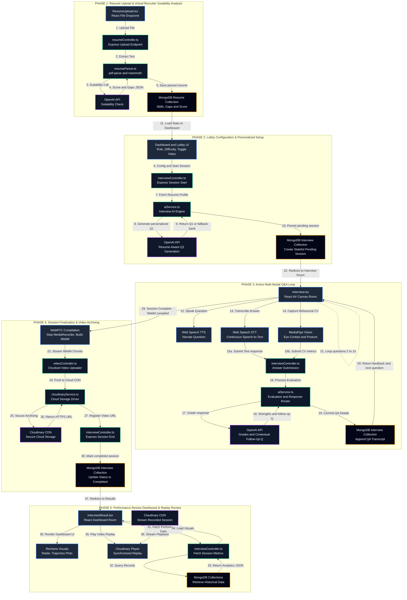

# AI Mock Interview Platform

A full-stack AI-powered interview preparation platform with real-time video recording, live coding environment, intelligent question generation, and detailed performance analytics.

## Features

- **AI-Powered Interviews** — Dynamic question generation using the OpenAI API, personalized from your uploaded resume
- **Video Recording** — WebRTC-based real-time webcam and microphone capture, stored on Cloudinary CDN
- **Live Coding Environment** — Monaco Editor with multi-language support (JavaScript, Python, C++)
- **Body Language Analysis** — MediaPipe-based face detection tracking eye contact, head pose, and engagement metrics
- **Resume Parsing** — PDF and DOCX parsing to extract skills, projects, and work experience
- **Analytics Dashboard** — Score trends, weak area identification, radar charts, and performance tracking
- **Transcript & Replay** — Full interview transcript with Q&A review and synchronized video playback

## System Architecture & Data Flow

The platform is designed with a highly integrated, multi-modal system architecture. The flowchart below shows how all client sub-systems, Express controllers, database models, and cloud APIs interact in real-time across five distinct phases.



---

## Step-by-Step Execution Flow

### Phase 1: Authentication & Onboarding

1. **User Sign-up / Login:** The candidate visits the registration page. Passwords are hashed using `bcrypt` inside `authController.ts` and user profiles are created in the `User` MongoDB model. All subsequent backend communication is protected via **JSON Web Tokens (JWT)**.

2. **Resume Upload:** The candidate uploads their resume (PDF or DOCX) via `ResumeUpload.tsx`.

3. **Parsing & Text Extraction:** The Express API endpoint `POST /api/resume/upload` receives the file. Inside `resumeParser.ts`, the file extension is detected automatically — `pdf-parse` handles PDFs and `mammoth` handles DOCX files.

4. **AI Suitability Check:** The extracted raw text (skills, projects, experience) is sent to the **OpenAI API**. The model returns a structured JSON response containing a **Suitability Score (0–100)**, matched skills, critical skill gaps for the target role, and personalized profile enhancement tips.

5. **Database Storage:** The parsed data and AI analysis results are committed to MongoDB under the `Resume` model, linked directly to the `User`. The dashboard reloads automatically to display these metrics.

### Phase 2: Interview Configuration & Session Start

6. **Lobby Customization:** The user selects their target role, interview duration, difficulty level (Easy, Medium, or Hard), and optionally enables Video Recording. They then click **Start Interview**.

7. **Session Initialization:** The frontend sends `POST /api/interview/start`. `interviewController.ts` creates a stateful `Interview` document in MongoDB with a `pending` status.

8. **AI-Powered Question 1 Generation:** In the backend, `aiService.ts` checks whether the user has a saved resume. If yes, it fetches the candidate's skills and projects from the `Resume` model and constructs a rich prompt (including the resume profile, difficulty level, and target role) to generate a **highly personalized first question** via the **OpenAI API** (e.g., if React is listed on the resume, a React-specific question is generated). If the API is unavailable, the service falls back to a **31+ question bank** spanning DSA, System Design, Databases, HR, and Project-based categories.

9. **Session Delivery:** The generated question is returned to the browser, redirecting the user to the Interview room (`Interview.tsx`).

### Phase 3: Active Multi-Modal Q&A Loop

10. **AV Streams & Body Language Tracking:** The camera and microphone are activated via **WebRTC** (`navigator.mediaDevices.getUserMedia`). A `MediaRecorder` instance begins capturing the video stream in the background. A custom React hook, `useBodyLanguageAnalysis`, initializes **MediaPipe** on a canvas element to track live behavioral parameters: **eye contact frequency**, **head orientation** (detecting off-screen distraction), and **facial pose confidence**.

11. **Question Narration (TTS):** The browser's **Web Speech Synthesis API** reads the generated question aloud, acting as the voice of the AI interviewer.

12. **Speech-to-Text Transcription:** The candidate responds by typing, or by toggling **Voice Input** which activates the browser's built-in **Web Speech Recognition API** (`webkitSpeechRecognition`) to transcribe spoken words into the answer text field in real-time.

13. **Answer Submission & Evaluation:** The user clicks **Submit Answer**, sending the response to `POST /api/interview/submit-answer`.
    - `aiService.ts` prompts the **OpenAI API** to evaluate the answer across dimensions: depth of knowledge, communication structure, technical accuracy, and use of practical examples.
    - The API returns a structured JSON response containing:
      - **Score:** A 1–5 scale rating.
      - **Overall Feedback:** A detailed assessment of the answer.
      - **Strengths:** 2–3 specific elements the candidate explained well.
      - **Areas for Improvement:** Actionable notes on missing or weak points.
      - **Follow-up Question:** A deeper, context-aware question based on what the candidate just answered.
    - **Fallback Mode:** If the OpenAI API is unavailable, a local tokenization service analyzes word overlap against ideal answer templates, scoring based on structural completeness, use of examples, and minimum response length.

14. **Question Loop:** The candidate receives immediate color-coded feedback on screen, then clicks **Next Question** to proceed to the follow-up or the next core question. This loop continues for up to 10 questions.

### Phase 4: Session End & Video Archiving

15. **Stop Capture:** The interview ends when 10 questions are complete, when the user manually ends the session, or when the timer expires.
    - The `MediaRecorder` is stopped, compiling all buffered chunks into a single WebM video blob.
    - The MediaPipe vision loop halts, consolidating all tracking metrics into averaged behavioral scores.

16. **Session Finalization:** The frontend triggers `POST /api/interview/end`, sending the body language averages to the server. The server calls the OpenAI API to generate a personalized closing summary, sets the interview status to `completed`, and updates the `Interview` document in MongoDB.

17. **Cloud Video Upload:** The WebM blob is streamed to the backend via `POST /api/video/upload-chunk`. `cloudinaryService.ts` uploads the file to **Cloudinary**, which returns a secure HTTPS URL and a Public ID. These are saved to the interview record in MongoDB.

### Phase 5: Analytics Dashboard & Replay

18. **Results Page:** The candidate is redirected to `InterviewResult.tsx`.

19. **Performance Visualization:** The page fetches the complete interview record and renders interactive Recharts visualizations — radar charts for category scores, score trajectory plots, and body language compliance metrics.

20. **Video Replay:** The candidate can review their complete Q&A transcript alongside graded feedback, and play back their recorded session directly via the integrated Cloudinary video player.

---

## Tech Stack

### Frontend
| Technology | Purpose |
|---|---|
| React 18 + TypeScript | Core UI framework |
| Vite | Build tool and dev server |
| Tailwind CSS | Utility-first styling |
| Zustand | Global state management |
| React Router DOM v6 | Client-side routing |
| Framer Motion | Animations and transitions |
| Radix UI | Accessible headless components |
| Monaco Editor | In-browser code editor |
| Recharts | Performance analytics charts |
| Axios | HTTP client |
| MediaPipe Tasks Vision | Real-time face and body tracking |
| WebRTC (browser API) | Camera/microphone capture and recording |
| Web Speech API (browser) | Text-to-speech (TTS) and speech-to-text (STT) |

### Backend
| Technology | Purpose |
|---|---|
| Node.js + Express | REST API server |
| TypeScript | Type-safe backend code |
| MongoDB + Mongoose | Database and ODM |
| JSON Web Tokens (JWT) | Authentication |
| bcryptjs | Password hashing |
| OpenAI API (GPT) | AI question generation and answer evaluation |
| Cloudinary | Cloud video storage and streaming |
| multer | File upload handling |
| pdf-parse + mammoth | Resume parsing (PDF and DOCX) |
| socket.io | Real-time communication |
| helmet | HTTP security headers |
| express-validator | Input validation |

## Project Structure

This folder tree represents the actual set of files tracked in Git and pushed to GitHub:

```
AI-Mock-Interview-Platform/
├── backend/                             # Express Backend Service
│   ├── src/
│   │   ├── config/                      # Database & config entrypoint
│   │   │   ├── db.ts
│   │   │   └── index.ts
│   │   ├── controllers/                 # Express controllers for routes
│   │   │   ├── authController.ts
│   │   │   ├── interviewController.ts
│   │   │   ├── resumeController.ts
│   │   │   └── videoController.ts
│   │   ├── middleware/                  # Endpoint routers validation & upload rules
│   │   │   ├── auth.ts
│   │   │   ├── errorHandler.ts
│   │   │   ├── fileValidation.ts
│   │   │   ├── upload.ts
│   │   │   └── validation.ts
│   │   ├── models/                      # Mongoose models schema
│   │   │   ├── Interview.ts
│   │   │   ├── Resume.ts
│   │   │   └── User.ts
│   │   ├── routes/                      # API routing endpoints
│   │   │   ├── analytics.ts
│   │   │   ├── auth.ts
│   │   │   ├── demo.ts
│   │   │   ├── interview.ts
│   │   │   ├── resume.ts
│   │   │   └── video.ts
│   │   ├── services/                    # Business core logic
│   │   │   ├── aiService.ts
│   │   │   ├── cloudinaryService.ts
│   │   │   ├── resumeParser.ts
│   │   │   └── videoService.ts
│   │   ├── types/                       # Custom TypeScript types
│   │   │   ├── declarations.d.ts
│   │   │   └── file-type.d.ts
│   │   ├── utils/                       # DB helpers
│   │   │   └── dropDuplicateIndex.ts
│   │   └── index.ts                     # Express app main listener
│   ├── uploads/                         # PDF resume uploads directory (tracked samples)
│   ├── .env.example
│   ├── package.json
│   ├── package-lock.json
│   └── tsconfig.json
├── frontend/                            # React Client (Vite + TypeScript)
│   ├── src/
│   │   ├── components/                  # Premium visual elements and canvas elements
│   │   │   ├── 3d/                      # Three.js / Canvas setups
│   │   │   │   ├── AnimatedCanvas.tsx
│   │   │   │   └── BackgroundScene.tsx
│   │   │   ├── ui/                      # Base visual elements (buttons, inputs)
│   │   │   │   ├── badge.tsx, button.tsx, card.tsx, input.tsx, label.tsx,
│   │   │   │   └── progress.tsx, scroll-area.tsx, sidebar.tsx, switch.tsx, textarea.tsx
│   │   │   ├── AnimatedCard3D.tsx
│   │   │   ├── AnimationHelpers.tsx
│   │   │   ├── ErrorBoundary.tsx
│   │   │   ├── Logo.tsx
│   │   │   ├── ParticleEffect.tsx
│   │   │   ├── ScrollAnimations.tsx
│   │   │   ├── SmoothScrollProvider.tsx
│   │   │   ├── ThemeToggle.tsx
│   │   │   ├── VideoPlayer.tsx
│   │   │   └── theme-provider.tsx
│   │   ├── hooks/                       # Custom hooks (facial expression tracker)
│   │   │   └── useBodyLanguageAnalysis.ts
│   │   ├── lib/                         # Monaco & scroll helper functions
│   │   │   ├── smoothScroll.ts
│   │   │   └── utils.ts
│   │   ├── pages/                       # Screen views and dashboard boards
│   │   │   ├── Analytics.tsx
│   │   │   ├── Dashboard.tsx
│   │   │   ├── DemoPage.tsx
│   │   │   ├── Interview.tsx
│   │   │   ├── InterviewResult.tsx
│   │   │   ├── InterviewSetup.tsx
│   │   │   ├── LandingPage.tsx
│   │   │   ├── LiveCodingEditor.tsx
│   │   │   ├── Login.tsx
│   │   │   ├── Profile.tsx
│   │   │   ├── Register.tsx
│   │   │   ├── ResumeUpload.tsx
│   │   │   ├── Settings.tsx
│   │   │   └── VideoLibrary.tsx
│   │   ├── services/                    # Axios clients and core endpoints API
│   │   │   └── api.ts
│   │   ├── store/                       # Zustand auth persistence state
│   │   │   └── authStore.ts
│   │   ├── types/                       # Client TS types
│   │   │   └── index.ts
│   │   ├── App.tsx                      # Frontend router & page wrapper
│   │   ├── index.css                    # Entry tailwind styling rules
│   │   ├── main.tsx                     # React client bootstrap entry
│   │   └── vite-env.d.ts
│   ├── index.html
│   ├── package.json
│   ├── package-lock.json
│   ├── postcss.config.js
│   ├── tailwind.config.js
│   ├── tsconfig.json
│   ├── tsconfig.node.json
│   └── vite.config.ts
├── .gitignore
├── package.json                         # Workspace monorepo root package file
├── render.yaml                          # Render hosting configurations
├── SPEC.md                              # Backend specification reference
└── README.md                            # Comprehensive README & Flow diagram (This file)
```

## Setup & Installation

### Prerequisites

- **Node.js** v18 or higher
- **MongoDB** (local instance or MongoDB Atlas)
- **OpenAI API Key** — [platform.openai.com](https://platform.openai.com)
- **Cloudinary Account** — [cloudinary.com](https://cloudinary.com) (free tier is sufficient)

### 1. Clone the Repository

```bash
git clone https://github.com/your-username/AI-Mock-Interview-Platform.git
cd AI-Mock-Interview-Platform
```

### 2. Backend Setup

```bash
cd backend
npm install
```

Create a `.env` file in the `backend/` directory (use `.env.example` as a template):

```env
PORT=5000
MONGODB_URI=mongodb://localhost:27017/ai-interview
JWT_SECRET=your-super-secret-jwt-key-change-in-production
NODE_ENV=development
OPENAI_API_KEY=your-openai-api-key-here
CLOUDINARY_CLOUD_NAME=your-cloudinary-cloud-name
CLOUDINARY_API_KEY=your-cloudinary-api-key
CLOUDINARY_API_SECRET=your-cloudinary-api-secret
```

Start the backend development server:

```bash
npm run dev
```

The backend API will be available at `http://localhost:5000`.

### 3. Frontend Setup

```bash
cd frontend
npm install
npm run dev
```

The frontend development server will be available at `http://localhost:5173`.

### 4. Run Both Concurrently (from the root)

```bash
npm run dev
```

## API Endpoints

### Authentication
| Method | Endpoint | Description |
|---|---|---|
| `POST` | `/api/auth/register` | Register a new user |
| `POST` | `/api/auth/login` | Login and receive a JWT |
| `GET` | `/api/auth/me` | Get the currently authenticated user |

### Resume
| Method | Endpoint | Description |
|---|---|---|
| `POST` | `/api/resume/upload` | Upload a resume (multipart/form-data) |
| `GET` | `/api/resume/:id` | Get a resume by ID |
| `GET` | `/api/resume/user/:userId` | Get all resumes for a user |
| `DELETE` | `/api/resume/:id` | Delete a resume |

### Interview
| Method | Endpoint | Description |
|---|---|---|
| `POST` | `/api/interview/start` | Start a new interview session |
| `GET` | `/api/interview/next-question/:interviewId` | Get the next question |
| `POST` | `/api/interview/submit-answer/:interviewId` | Submit an answer for evaluation |
| `POST` | `/api/interview/end/:interviewId` | End the interview session |
| `GET` | `/api/interview/:id` | Get interview details |
| `GET` | `/api/interview/user/:userId` | Get all interviews for a user |
| `GET` | `/api/interview/transcript/:id` | Get the full interview transcript |

### Video
| Method | Endpoint | Description |
|---|---|---|
| `POST` | `/api/video/upload-chunk` | Upload a video chunk |
| `POST` | `/api/video/finalize` | Finalize and commit the video |
| `GET` | `/api/video/:id` | Get video metadata |
| `GET` | `/api/video/:id/download` | Download the recorded video |
| `POST` | `/api/video/analyze-body-language` | Submit body language metrics |

### Analytics
| Method | Endpoint | Description |
|---|---|---|
| `GET` | `/api/analytics/:userId` | Get analytics summary for a user |
| `GET` | `/api/analytics/interview/:id` | Get analytics for a specific interview |

## Environment Variables Reference

### Backend (`backend/.env`)

| Variable | Required | Description |
|---|---|---|
| `PORT` | Yes | Port for the Express server (default: `5000`) |
| `MONGODB_URI` | Yes | MongoDB connection string |
| `JWT_SECRET` | Yes | Secret key for signing JWTs |
| `NODE_ENV` | No | `development` or `production` |
| `OPENAI_API_KEY` | Yes | OpenAI API key for question generation and evaluation |
| `CLOUDINARY_CLOUD_NAME` | Yes | Cloudinary cloud name |
| `CLOUDINARY_API_KEY` | Yes | Cloudinary API key |
| `CLOUDINARY_API_SECRET` | Yes | Cloudinary API secret |

## Deployment

### Frontend — Vercel

1. Push code to GitHub.
2. Import the project on [vercel.com](https://vercel.com).
3. Set the **root directory** to `frontend`.
4. Build command: `npm run build`
5. Output directory: `dist`
6. Deploy.

### Backend — Render

1. Connect your GitHub repository on [render.com](https://render.com).
2. Select **Web Service** and set the **root directory** to `backend`.
3. Build command: `npm run build`
4. Start command: `npm start`
5. Add all environment variables in the Render dashboard.

A `render.yaml` configuration file is included in the repository root for one-click deployment.

### Database — MongoDB Atlas

1. Create a free-tier cluster on [mongodb.com/atlas](https://www.mongodb.com/atlas).
2. Add your server's IP to the Atlas IP Access List.
3. Copy the connection string and set it as `MONGODB_URI` in your backend environment.

## Security

- **JWT Authentication** — All protected routes require a valid Bearer token
- **Password Hashing** — All passwords are hashed with `bcrypt` before storage
- **CORS Configuration** — Restricted to allowed origins
- **Helmet** — Sets secure HTTP response headers
- **File Type Validation** — Resume uploads are validated for allowed MIME types
- **Input Validation** — All API inputs are validated with `express-validator`

---

## License

MIT