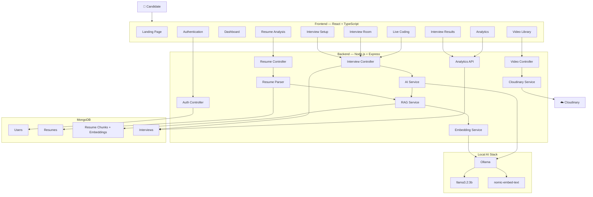

# 🤖 Arpit's AI Mock Interview Platform

<div align="center">

### **PrepVerse — AI-Powered Interview Preparation Platform**

An intelligent full-stack mock interview platform that combines **AI-generated interviews, resume-aware RAG, real-time video recording, live coding, speech interaction, body-language analysis, and performance analytics** into one complete interview preparation experience.

<br />

**Built with React • Node.js • Express • MongoDB • TypeScript • Ollama • RAG • Cloudinary**

<br />

> 🚧 **Project Status:** Fully functional locally. Deployment is currently in progress.

</div>

---

## ✨ Overview

**PrepVerse** is an AI-powered mock interview platform designed to simulate a realistic technical interview experience.

Instead of asking the same predefined questions to every candidate, the platform can analyze an uploaded resume, extract meaningful information, store semantic resume chunks as embeddings, and use **Retrieval-Augmented Generation (RAG)** to provide the AI interviewer with relevant candidate context.

The platform supports:

* 📄 Resume upload and intelligent parsing
* 🧠 Resume-aware AI interviews using RAG
* 🦙 Local AI inference using Ollama
* 🎯 Role-specific resume analysis
* 💬 Dynamic interview question generation
* 📝 AI-powered answer evaluation
* 🎤 Speech-to-text input
* 🔊 Text-to-speech questions
* 📹 Real-time video recording
* ☁️ Cloudinary video storage
* 👁️ Body-language analysis
* 💻 Live coding environment
* 📊 Interview analytics
* 📜 Interview transcripts
* 🔐 JWT authentication

---

# 🚀 Key Features

## 🧠 AI-Powered Mock Interviews

PrepVerse generates interview questions dynamically instead of relying exclusively on static question banks.

The AI interviewer can consider:

* Target job role
* Interview difficulty
* Resume skills
* Projects
* Work experience
* Previous answers
* Interview context

The interview can progressively adapt based on the candidate's responses.

---

## 📄 Resume Analysis

Candidates can upload:

* PDF
* DOCX

The platform extracts:

* Skills
* Projects
* Work experience
* Education
* Certifications
* Raw resume text

The extracted resume is stored in MongoDB and can be used throughout the interview process.

### Resume Analysis Dashboard

After uploading a resume, candidates can select a target role such as:

* Frontend Developer
* Backend Developer
* Full Stack Developer
* MERN Stack Developer
* MEVN Stack Developer
* Mobile Developer
* Data Science Engineer
* Data Analyst
* DevOps / SRE
* Cloud Engineer
* QA Engineer

The AI analysis provides:

* 🎯 Suitability score
* ✅ Matched skills
* ❌ Missing skills
* 💡 Improvement recommendations

---

# 🧠 RAG-Based Resume Intelligence

One of the major upgrades in the latest version is the introduction of a **Retrieval-Augmented Generation (RAG)** pipeline.

Instead of sending the entire resume to the AI model every time, the resume is transformed into smaller semantic chunks.

### RAG Pipeline

```text
Resume PDF / DOCX
       │
       ▼
 Resume Parser
       │
       ▼
 Extract Full Resume Text
       │
       ▼
 Chunk Resume Text
       │
       ▼
 Generate Embeddings
       │
       ▼
 Store Embeddings in MongoDB
       │
       ▼
 User Starts Interview
       │
       ▼
 Interview Query
       │
       ▼
 Generate Query Embedding
       │
       ▼
 Cosine Similarity Search
       │
       ▼
 Retrieve Relevant Resume Chunks
       │
       ▼
 Build AI Context
       │
       ▼
 Ollama LLM
       │
       ▼
 Personalized Interview Question
```

### Why RAG?

RAG allows the AI interviewer to retrieve only the most relevant parts of a resume for a particular question.

For example:

```text
Candidate Resume

Skills:
React
Node.js
MongoDB

Projects:
AI Chatbot
E-Commerce Platform
Video Conferencing App
```

If the interviewer wants to ask about the candidate's backend experience, the system can retrieve the relevant resume context before generating the question.

This makes the interview more **resume-aware and contextual**.

---

# 🦙 Local AI with Ollama

The current version uses **Ollama for local AI inference**, eliminating the need for a paid OpenAI API for the core AI interview functionality.

### Current models

| Model              | Purpose                                                    |
| ------------------ | ---------------------------------------------------------- |
| `llama3.2:3b`      | Interview question generation, evaluation and AI responses |
| `nomic-embed-text` | Resume embeddings and semantic retrieval                   |

### Local AI Architecture

```text
Backend
   │
   ├── Interview Question
   │          │
   │          ▼
   │     Ollama API
   │          │
   │          ▼
   │    llama3.2:3b
   │
   └── Resume Query
              │
              ▼
        Ollama Embeddings
              │
              ▼
       nomic-embed-text
```

This architecture allows the AI system to run locally without sending resume content to an external AI provider.

---

# 📹 Real-Time Interview Experience

The interview room combines multiple browser technologies to create an interactive interview environment.

### Video

The browser uses:

```text
navigator.mediaDevices.getUserMedia()
```

to access:

* Webcam
* Microphone

A `MediaRecorder` records the interview session.

Recorded videos can be uploaded to **Cloudinary** for storage and playback.

---

# 🎤 Voice Interaction

The platform uses browser-native Web Speech APIs.

### Text-to-Speech

AI-generated questions can be spoken aloud using:

```text
Web Speech Synthesis API
```

### Speech-to-Text

Candidates can use voice input through:

```text
Web Speech Recognition API
```

This converts spoken responses into text for submission.

---

# 👁️ Body Language Analysis

The interview experience also includes browser-side visual analysis using **MediaPipe Tasks Vision**.

The system can track behavioral signals such as:

* 👀 Eye contact
* 🧑 Head orientation
* 🎯 Attention / engagement indicators
* 📐 Facial pose information

These metrics can contribute to the overall interview performance analysis.

---

# 💻 Live Coding Environment

The platform includes an integrated coding environment powered by **Monaco Editor**.

Supported languages include:

* JavaScript
* Python
* C++

This allows candidates to solve programming questions without leaving the interview environment.

---

# 📊 Performance Analytics

After completing an interview, candidates can review their performance through an analytics dashboard.

The system can present:

* Overall interview score
* Question-wise scores
* Technical performance
* Communication feedback
* Strengths
* Areas for improvement
* Body-language metrics
* Score trends
* Performance history

Visualizations are implemented using **Recharts**.

---

# 📜 Interview Transcript

Each interview maintains a conversation history containing:

```text
AI Question
      ↓
Candidate Answer
      ↓
AI Evaluation
      ↓
Strengths
      ↓
Areas for Improvement
      ↓
Follow-up Question
```

This allows candidates to review their complete interview after finishing the session.

---

# 🏗️ System Architecture



---

# 🔄 Complete Application Flow

## 1️⃣ Authentication

```text
Register
   ↓
Password Hashing
   ↓
MongoDB User
   ↓
JWT Token
   ↓
Authenticated Application
```

Passwords are hashed using `bcryptjs`, while protected API routes use JWT authentication.

---

## 2️⃣ Resume Upload

```text
User selects PDF/DOCX
        ↓
Frontend ResumeUpload.tsx
        ↓
POST /api/resume/upload
        ↓
Express + Multer
        ↓
resumeParser.ts
        ↓
Extract Resume Text
        ↓
Save Resume
        ↓
Create RAG Chunks
        ↓
Generate Embeddings
        ↓
Store in MongoDB
```

---

## 3️⃣ Resume Analysis

```text
Uploaded Resume
      ↓
Select Target Role
      ↓
AI Analysis
      ↓
Suitability Score
      ↓
Matched Skills
      ↓
Skill Gaps
      ↓
Recommendations
```

---

## 4️⃣ Interview Start

```text
Interview Setup
      ↓
Role + Difficulty + Resume
      ↓
Create Interview Session
      ↓
Retrieve Relevant Resume Context
      ↓
Ollama
      ↓
Generate Personalized Question
      ↓
Interview Room
```

---

## 5️⃣ Interview Q&A

```text
AI Question
     ↓
TTS
     ↓
Candidate Response
     ↓
Typing / Voice Input
     ↓
Answer Submission
     ↓
AI Evaluation
     ↓
Score + Feedback
     ↓
Follow-up Question
     ↓
Next Question
```

The process repeats throughout the interview session.

---

## 6️⃣ Video Recording

```text
Camera + Microphone
        ↓
MediaRecorder
        ↓
WebM Recording
        ↓
Backend Video API
        ↓
Cloudinary
        ↓
Secure Video URL
        ↓
MongoDB Interview Record
```

---

## 7️⃣ Interview Results

```text
Completed Interview
       ↓
Performance Data
       ↓
Analytics API
       ↓
Interview Results
       ↓
Charts + Transcript + Feedback
       ↓
Video Replay
```

---

# 🛠️ Technology Stack

## Frontend

| Technology             | Purpose                   |
| ---------------------- | ------------------------- |
| React                  | UI framework              |
| TypeScript             | Type safety               |
| Vite                   | Development/build tooling |
| Tailwind CSS           | Styling                   |
| Zustand                | Global state management   |
| React Router           | Application routing       |
| Framer Motion          | Animations                |
| Lucide React           | Icons                     |
| Monaco Editor          | Live coding               |
| Recharts               | Analytics visualization   |
| Axios                  | API communication         |
| MediaPipe Tasks Vision | Visual analysis           |
| WebRTC Browser APIs    | Camera & microphone       |
| Web Speech API         | TTS/STT                   |

---

## Backend

| Technology        | Purpose                 |
| ----------------- | ----------------------- |
| Node.js           | Runtime                 |
| Express.js        | REST API                |
| TypeScript        | Type safety             |
| MongoDB           | Database                |
| Mongoose          | MongoDB ODM             |
| JWT               | Authentication          |
| bcryptjs          | Password hashing        |
| Multer            | File uploads            |
| pdf-parse         | PDF parsing             |
| Mammoth           | DOCX parsing            |
| Socket.IO         | Real-time communication |
| Helmet            | HTTP security           |
| express-validator | Request validation      |

---

## AI / RAG

| Technology        | Purpose                         |
| ----------------- | ------------------------------- |
| Ollama            | Local AI runtime                |
| Llama 3.2 3B      | Interview generation/evaluation |
| nomic-embed-text  | Resume embeddings               |
| MongoDB           | Embedding storage               |
| Cosine Similarity | Semantic retrieval              |
| RAG               | Resume-aware AI context         |

---

## Cloud

| Technology    | Purpose                     |
| ------------- | --------------------------- |
| Cloudinary    | Interview video storage     |
| MongoDB Atlas | Planned production database |
| Vercel        | Planned frontend deployment |
| Render        | Planned backend deployment  |

> **Note:** The deployment targets above are planned. The project is currently being developed and tested locally.

---

# 📁 Project Structure

```text
Arpit-s-Interview/
│
├── backend/
│   ├── src/
│   │   ├── config/
│   │   │   ├── db.ts
│   │   │   └── index.ts
│   │   │
│   │   ├── controllers/
│   │   │   ├── authController.ts
│   │   │   ├── interviewController.ts
│   │   │   ├── resumeController.ts
│   │   │   └── videoController.ts
│   │   │
│   │   ├── middleware/
│   │   │   ├── auth.ts
│   │   │   ├── errorHandler.ts
│   │   │   ├── fileValidation.ts
│   │   │   ├── upload.ts
│   │   │   └── validation.ts
│   │   │
│   │   ├── models/
│   │   │   ├── Interview.ts
│   │   │   ├── Resume.ts
│   │   │   ├── ResumeChunk.ts
│   │   │   └── User.ts
│   │   │
│   │   ├── routes/
│   │   │   ├── analytics.ts
│   │   │   ├── authRoutes.ts
│   │   │   ├── demo.ts
│   │   │   ├── interview.ts
│   │   │   ├── resume.ts
│   │   │   └── video.ts
│   │   │
│   │   ├── services/
│   │   │   ├── aiService.ts
│   │   │   ├── cloudinaryService.ts
│   │   │   ├── embeddingService.ts
│   │   │   ├── ragService.ts
│   │   │   ├── resumeParser.ts
│   │   │   └── videoService.ts
│   │   │
│   │   ├── types/
│   │   ├── utils/
│   │   └── index.ts
│   │
│   ├── uploads/
│   ├── .env.example
│   ├── package.json
│   ├── package-lock.json
│   └── tsconfig.json
│
├── frontend/
│   ├── src/
│   │   ├── components/
│   │   ├── hooks/
│   │   │   └── useBodyLanguageAnalysis.ts
│   │   ├── lib/
│   │   ├── pages/
│   │   │   ├── Analytics.tsx
│   │   │   ├── Dashboard.tsx
│   │   │   ├── Interview.tsx
│   │   │   ├── InterviewResult.tsx
│   │   │   ├── InterviewSetup.tsx
│   │   │   ├── LandingPage.tsx
│   │   │   ├── LiveCodingEditor.tsx
│   │   │   ├── Login.tsx
│   │   │   ├── Profile.tsx
│   │   │   ├── Register.tsx
│   │   │   ├── ResumeUpload.tsx
│   │   │   ├── Settings.tsx
│   │   │   └── VideoLibrary.tsx
│   │   ├── services/
│   │   │   └── api.ts
│   │   ├── store/
│   │   │   └── authStore.ts
│   │   ├── types/
│   │   ├── App.tsx
│   │   ├── index.css
│   │   └── main.tsx
│   │
│   ├── package.json
│   ├── package-lock.json
│   ├── vite.config.ts
│   └── tsconfig.json
│
├── .gitignore
├── package.json
├── render.yaml
├── SPEC.md
└── README.md
```

---

# ⚙️ Local Installation

## Prerequisites

Install the following:

* Node.js 18+
* MongoDB or MongoDB Atlas
* Ollama
* Git
* Cloudinary account for video storage

---

# 🦙 Install Ollama

Download and install Ollama for your operating system.

After installation, pull the required models:

```bash
ollama pull llama3.2:3b
ollama pull nomic-embed-text
```

Verify:

```bash
ollama list
```

You should see:

```text
llama3.2:3b
nomic-embed-text
```

Ollama normally runs locally on:

```text
http://localhost:11434
```

---

# 📥 Clone the Repository

```bash
git clone https://github.com/your-username/Arpit-s-Interview.git
cd Arpit-s-Interview
```

---

# 🔧 Backend Setup

```bash
cd backend
npm install
```

Create:

```text
backend/.env
```

Example:

```env
PORT=5000

MONGODB_URI=mongodb://127.0.0.1:27017/ai-interview

JWT_SECRET=your-super-secret-jwt-key

NODE_ENV=development

OLLAMA_BASE_URL=http://localhost:11434

OLLAMA_MODEL=llama3.2:3b

OLLAMA_EMBEDDING_MODEL=nomic-embed-text

CLOUDINARY_CLOUD_NAME=your-cloudinary-cloud-name
CLOUDINARY_API_KEY=your-cloudinary-api-key
CLOUDINARY_API_SECRET=your-cloudinary-api-secret
```

> Never commit `.env` to GitHub.

Start the backend:

```bash
npm run dev
```

Backend:

```text
http://localhost:5000
```

---

# 🎨 Frontend Setup

Open another terminal:

```bash
cd frontend
npm install
```

Create:

```text
frontend/.env
```

Example:

```env
VITE_BACKEND_URL=http://localhost:5000
```

Start the frontend:

```bash
npm run dev
```

Frontend:

```text
http://localhost:5173
```

---

# 🧪 Build the Project

### Backend

```bash
cd backend
npm run build
```

### Frontend

```bash
cd frontend
npm run build
```

---

# 🔌 API Endpoints

## Authentication

| Method | Endpoint             | Description            |
| ------ | -------------------- | ---------------------- |
| POST   | `/api/auth/register` | Register user          |
| POST   | `/api/auth/login`    | Login                  |
| GET    | `/api/auth/me`       | Get authenticated user |
| PATCH  | `/api/auth/profile`  | Update profile         |
| PATCH  | `/api/auth/settings` | Update settings        |

---

## Resume

| Method | Endpoint                   | Description               |
| ------ | -------------------------- | ------------------------- |
| POST   | `/api/resume/upload`       | Upload and process resume |
| GET    | `/api/resume/:id`          | Get resume                |
| GET    | `/api/resume/user/:userId` | Get user resumes          |
| POST   | `/api/resume/:id/analyze`  | Analyze resume            |
| DELETE | `/api/resume/:id`          | Delete resume             |

Resume processing includes:

```text
Upload
 → Parse
 → Extract Text
 → Chunk
 → Embed
 → Store
```

---

## Interview

| Method | Endpoint                           | Description         |
| ------ | ---------------------------------- | ------------------- |
| POST   | `/api/interview/start`             | Start interview     |
| GET    | `/api/interview/next-question/:id` | Get next question   |
| POST   | `/api/interview/submit-answer/:id` | Submit answer       |
| POST   | `/api/interview/end/:id`           | End interview       |
| GET    | `/api/interview/:id`               | Get interview       |
| GET    | `/api/interview/user/:userId`      | Get user interviews |
| GET    | `/api/interview/transcript/:id`    | Get transcript      |

---

## Video

| Method | Endpoint                           | Description                  |
| ------ | ---------------------------------- | ---------------------------- |
| POST   | `/api/video/upload-chunk`          | Upload recording chunk       |
| POST   | `/api/video/finalize`              | Finalize recording           |
| GET    | `/api/video/:id`                   | Get video metadata           |
| GET    | `/api/video/:id/download`          | Download video               |
| POST   | `/api/video/analyze-body-language` | Submit body-language metrics |

---

## Analytics

| Method | Endpoint                       | Description         |
| ------ | ------------------------------ | ------------------- |
| GET    | `/api/analytics/:userId`       | User analytics      |
| GET    | `/api/analytics/interview/:id` | Interview analytics |

---

# 🔐 Security

The application implements multiple security mechanisms:

* 🔑 JWT authentication
* 🔒 bcrypt password hashing
* 🛡️ Helmet security headers
* 🌐 CORS configuration
* ✅ Express-validator request validation
* 📄 Resume file validation
* 🔐 Protected API routes
* 🗝️ Environment-based secrets
* 👤 User-specific resume access

---

# 🧠 AI Architecture

The AI layer is intentionally designed to minimize external dependencies.

```text
                 ┌──────────────────────┐
                 │    Resume Upload     │
                 └──────────┬───────────┘
                            │
                            ▼
                 ┌──────────────────────┐
                 │    Resume Parser     │
                 └──────────┬───────────┘
                            │
                            ▼
                 ┌──────────────────────┐
                 │    Text Chunking     │
                 └──────────┬───────────┘
                            │
                            ▼
                 ┌──────────────────────┐
                 │ nomic-embed-text     │
                 └──────────┬───────────┘
                            │
                            ▼
                 ┌──────────────────────┐
                 │ MongoDB Embeddings   │
                 └──────────┬───────────┘
                            │
                            │ Retrieval
                            ▼
                 ┌──────────────────────┐
                 │ Relevant Resume      │
                 │ Context              │
                 └──────────┬───────────┘
                            │
                            ▼
                 ┌──────────────────────┐
                 │    llama3.2:3b       │
                 │      Ollama          │
                 └──────────┬───────────┘
                            │
                            ▼
                 ┌──────────────────────┐
                 │ Personalized         │
                 │ Interview Question   │
                 └──────────────────────┘
```

---

# 📈 Current Development Status

| Module                 | Status            |
| ---------------------- | ----------------- |
| Authentication         | ✅ Working         |
| Resume Upload          | ✅ Working locally |
| PDF Parsing            | ✅ Working         |
| DOCX Parsing           | ✅ Working         |
| Resume Chunking        | ✅ Working         |
| Resume Embeddings      | ✅ Working         |
| MongoDB RAG Storage    | ✅ Working         |
| Ollama Integration     | ✅ Working locally |
| Resume Analysis        | ✅ Working locally |
| AI Question Generation | ✅ Working locally |
| AI Answer Evaluation   | ✅ Working locally |
| Interview Flow         | ✅ Working locally |
| Video Recording        | ✅ Working locally |
| Cloudinary Upload      | ✅ Working locally |
| Body Language Analysis | ✅ Implemented     |
| Live Coding            | ✅ Implemented     |
| Analytics              | ✅ Implemented     |
| Transcript             | ✅ Implemented     |
| Production Deployment  | 🚧 Pending        |

---

# 🗺️ Roadmap

### Current

* [x] MERN-based full-stack architecture
* [x] JWT authentication
* [x] Resume upload
* [x] PDF/DOCX parsing
* [x] Resume analysis
* [x] RAG implementation
* [x] MongoDB embedding storage
* [x] Local Ollama AI
* [x] Personalized interview questions
* [x] AI answer evaluation
* [x] Video recording
* [x] Cloudinary integration
* [x] Analytics
* [x] Live coding
* [x] Body-language analysis

### Next

* [ ] Production deployment
* [ ] Hosted Ollama/AI infrastructure
* [ ] MongoDB Atlas production setup
* [ ] Vercel frontend deployment
* [ ] Render backend deployment
* [ ] Production environment configuration
* [ ] Performance optimization
* [ ] Better semantic chunking
* [ ] Advanced interview analytics
* [ ] More programming languages
* [ ] Improved AI interviewer personality
* [ ] Interview history comparison
* [ ] Resume improvement assistant

---

# 🌐 Deployment

> 🚧 **Not deployed yet.**

The project is currently being tested locally.

The planned production architecture is:

```text
                 ┌──────────────────┐
                 │      Vercel      │
                 │    React App      │
                 └────────┬─────────┘
                          │
                          ▼
                 ┌──────────────────┐
                 │      Render      │
                 │ Node + Express   │
                 └───────┬──────────┘
                         │
              ┌──────────┼───────────┐
              ▼          ▼           ▼
        ┌──────────┐ ┌─────────┐ ┌──────────┐
        │ MongoDB  │ │ Ollama  │ │Cloudinary│
        │  Atlas   │ │  / AI   │ │  Videos  │
        └──────────┘ └─────────┘ └──────────┘
```

The AI infrastructure will need to be hosted separately because a deployed backend cannot access an Ollama instance running on a developer's local machine.

---

# 📸 Screenshots

Screenshots will be added after the production UI is finalized.

Planned sections:

* Landing Page
* Dashboard
* Resume Analysis
* Interview Setup
* Interview Room
* Live Coding
* Interview Results
* Analytics Dashboard
* Video Library

---

# 🎯 Project Goals

PrepVerse is designed around three major goals:

### 1. Personalization

Every candidate should receive questions relevant to their own experience rather than generic questions alone.

### 2. Realistic Interview Simulation

The combination of:

* Video
* Voice
* AI questions
* Live coding
* Body-language analysis
* Follow-up questions

creates a more realistic interview environment.

### 3. Actionable Feedback

Instead of simply assigning a score, the platform aims to explain:

```text
What you did well
       +
What you missed
       +
How to improve
       =
Better interview preparation
```

---

# 👨‍💻 Author

<div align="center">

### **Arpit Srivastava**

**Full Stack Developer | MERN Stack Developer | AI Application Developer**

B.Tech — Computer Science & Engineering

<br />

Built with ❤️, React, Node.js, MongoDB, TypeScript, RAG & Ollama.

</div>

---

# ⭐ Support

If you find this project interesting, consider giving the repository a ⭐ on GitHub.

More features and production deployment are currently being developed.

---

<div align="center">

### 🚀 PrepVerse

**Prepare Smarter. Practice Better. Interview With Confidence.**

</div>
